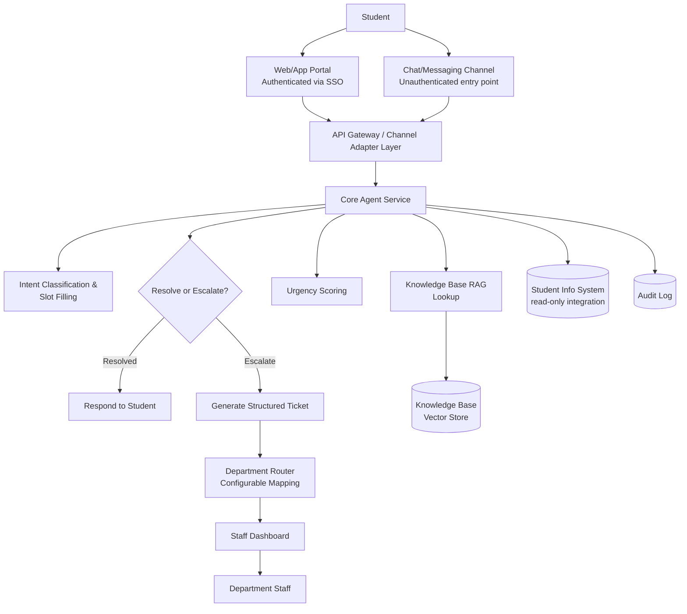
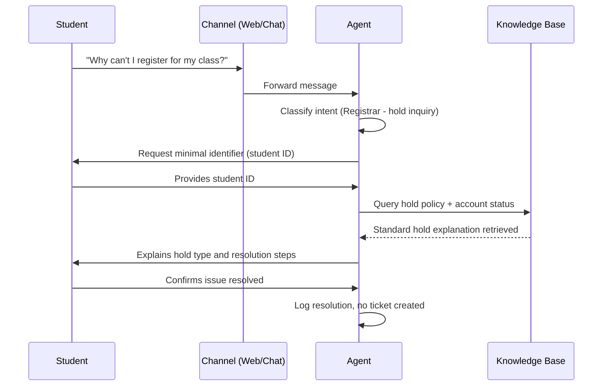
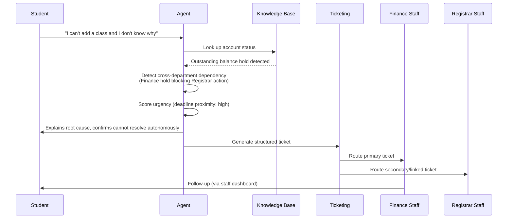
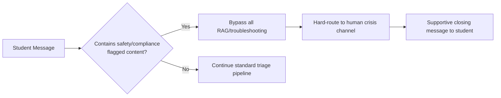
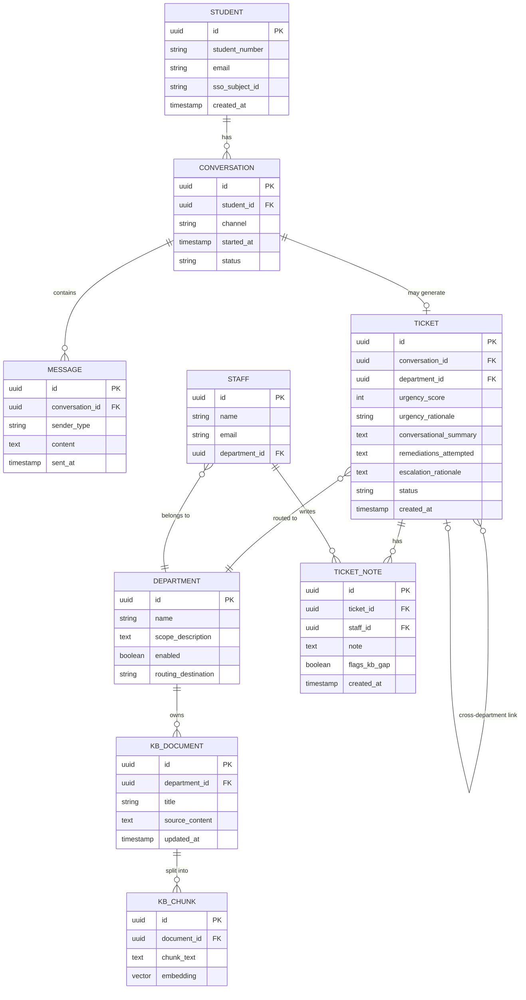
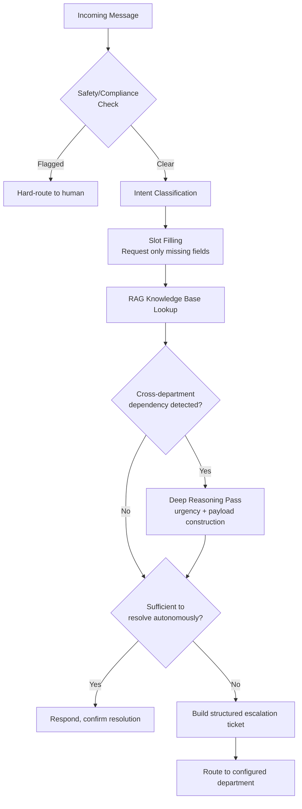

# Product Requirements Document: Campus Front Door
## AI-Driven University Support Triage System

**Version:** 1.0
**Status:** Implementation-ready
**Scope note:** This PRD is institution-agnostic by design. All department names, terminology, and workflows are configurable defaults, not hardcoded assumptions — the system is built to run at a Philippine university, a US university, or any institution with a comparable administrative structure, without a re-architecture.

---

## 1. Executive Summary

University support desks are overwhelmed by high-volume, low-complexity requests — password resets, balance inquiries, registration holds — that arrive through unstructured emails or forms and require manual reading, identity chasing, and ticket logging regardless of how simple the issue is. Meanwhile, 39% of student inquiries occur outside standard office hours and 14% on weekends, so the moment a student hits a blocker at night or on a weekend, resolution stalls until the next business day. Delays of up to 48 hours on genuinely urgent issues (exam-blocking access failures, deadline-adjacent holds) are common, and compounding unresolved ambiguity drives disengagement and dropout ("summer melt").

**Campus Front Door** is a cross-departmental, agentic support system that resolves FAQ-shaped requests autonomously, 24/7, across web and chat channels, and — when a request genuinely needs a human — hands departmental staff a fully-structured, context-complete ticket instead of a raw message they have to triage from scratch. The system is explicitly not a chatbot with a menu tree; it interprets natural, unstructured, sometimes emotional language, resolves what it can against an institutional knowledge base, and escalates the rest with zero redundant back-and-forth.

Design principle: **resolution-first, routing-second.** A ticket is a fallback state, not the default output.

---

## 2. Product Vision

A student should never have to know which office handles their problem, wait for office hours to get an answer to a question that's already documented somewhere, or repeat their situation three times to three different people. Campus Front Door is the single, always-available front door to every administrative office a student needs — reachable from a web portal or from the chat app they already have open — that either solves the problem on the spot or makes sure the right human gets it with everything they need to act immediately.

Long-term, the system becomes the institution's living operational memory: every escalation is a signal about what the knowledge base is missing, every resolved conversation makes the next one faster, and every department gets measurably less repetitive-intake load without losing control over anything that requires judgment, policy exception, or compliance sign-off.

---

## 3. Problem Statement

| Dimension | Current State | Cost |
|---|---|---|
| **Timing mismatch** | Student need is continuous; resolution capacity is 8 AM–5 PM only | 39% of inquiries off-hours, 14% on weekends get no response until next business day |
| **Manual intake** | Every request — regardless of complexity — requires a staff member to read, request missing identifiers, and manually log a ticket | Skilled staff time spent on repetitive, low-complexity work |
| **Undifferentiated urgency** | Simple and urgent requests enter the same queue | Exam-blocking or deadline-adjacent issues face delays up to 48 hours |
| **No institutional memory at the point of contact** | Students re-explain their situation to each new staff member/department | Redundant back-and-forth, slower resolution, worse student experience |
| **Compounding ambiguity** | Unresolved doubts don't stay static — they turn into missed deadlines | Contributes directly to disengagement and non-enrollment ("summer melt") |

---

## 4. Project Goals

1. Autonomously resolve the majority of FAQ-shaped inquiries (target: 70–80% of total volume) without staff involvement, at any hour
2. For the remainder, deliver escalation tickets structured enough that no staff member re-asks a question the agent already collected an answer to
3. Meet students on the channel they're already using off-hours (chat/messaging), not only a portal they have to remember exists
4. Reduce time-to-resolution for urgent, deadline-adjacent issues from days to minutes
5. Give institutions a configurable department model so the system adapts to differing administrative structures without code changes
6. Maintain a hard, auditable boundary around what the agent is never allowed to decide

### Non-Goals
- Replacing departmental staff or their decision authority
- Making policy exceptions, waivers, or overrides of any kind
- Handling legal, disciplinary, or clinical judgment calls
- Being a system of record — it is a front door and context-collection layer in front of each institution's existing systems (SIS, LMS, ticketing platform)

---

## 5. Target Users

| User Type | Relationship to System |
|---|---|
| **Students** (primary) | Initiate requests, interact conversationally, provide identity when prompted, confirm resolution |
| **Department Staff** | Receive structured tickets, resolve escalations, flag knowledge base gaps |
| **System/Knowledge Administrators** | Maintain the knowledge base, configure departments, set thresholds and boundaries |
| **Institution IT/Compliance Owners** | Own data governance, authentication integration, audit requirements |

---

## 6. User Personas

**Student — "Off-Hours Blocker"**
Third-year student, messages at 11 PM because a registration hold is blocking add/drop before tomorrow's deadline. Doesn't know or care which office owns the hold — just wants to know if it's fixable tonight and what happens if it isn't. Success = either resolved immediately or a ticket exists before they wake up, with no further action needed from them until staff respond.

**Student — "First-Time Navigator"**
Incoming or early-term student unfamiliar with institutional structure and jargon. Asks vague, sometimes emotionally charged questions ("I don't know why I have a hold, I already paid, please help"). Success = agent parses intent without requiring them to know the right vocabulary or department.

**Department Staff — "Registrar Officer"**
Handles a high daily volume of hold-related tickets. Wants tickets that arrive pre-verified and pre-classified, ideally with the specific hold type and student context attached, so they can act instead of investigate.

**System Administrator — "Knowledge Owner"**
Owns the FAQ/policy content that powers resolution. Needs visibility into which questions are escalating unnecessarily (a KB gap) versus escalating correctly (genuinely needs a human), and a low-friction way to update content without engineering involvement.

---

## 7. Functional Requirements

| ID | Requirement | Priority |
|---|---|---|
| FR-1 | Accept natural-language input across web and chat channels without requiring department pre-selection | P0 |
| FR-2 | Classify intent against a configurable set of department categories | P0 |
| FR-3 | Perform multi-turn slot-filling, requesting only missing identifiers, never re-asking known ones | P0 |
| FR-4 | Resolve FAQ-shaped queries via RAG against an institutional knowledge base | P0 |
| FR-5 | Score urgency using deadline proximity and signal keywords, surfaced to staff on escalation | P0 |
| FR-6 | Detect cross-department dependencies and route/tag tickets accordingly | P1 |
| FR-7 | Generate structured, high-fidelity escalation tickets on handoff | P0 |
| FR-8 | Hard-route safety/compliance-flagged content to a human channel immediately, bypassing all autonomous resolution | P0 |
| FR-9 | Allow students to confirm resolution or request escalation at any point | P0 |
| FR-10 | Support progressive authentication — general FAQs answerable unauthenticated, account-specific data gated behind verified identity | P0 |
| FR-11 | Allow administrators to configure departments, categories, and escalation routing without code changes | P1 |
| FR-12 | Allow staff to tag tickets as knowledge-base gaps, feeding a content-improvement queue | P1 |
| FR-13 | Maintain conversation history per student, retrievable across channels | P1 |
| FR-14 | Provide a staff-facing dashboard for ticket queues, filterable by department/urgency/status | P1 |
| FR-15 | Support file upload for document-dependent requests (e.g., scholarship/financial-aid verification documents) | P1 |

---

## 8. Non-Functional Requirements

| Category | Requirement |
|---|---|
| **Latency** | Conversational responses under ~2 seconds to prevent chat-channel drop-off |
| **Availability** | 24/7, including scheduled maintenance windows communicated in advance |
| **Data privacy** | Compliant with applicable data privacy law for the deployment institution (e.g., Philippine Data Privacy Act of 2012, or FERPA/GDPR where applicable) — no sensitive student data transmitted over unauthenticated channels |
| **Auditability** | Every autonomous resolution and every escalation decision logged with rationale |
| **Configurability** | Department taxonomy, escalation rules, and knowledge base content editable without a code deployment |
| **Scalability** | Must handle concurrent multi-channel load without degrading response latency |
| **Security** | Read-only access to student records by default; write-actions strictly allowlisted and audited |
| **Accessibility** | Web interface meets WCAG 2.1 AA at minimum |

---

## 9. System Architecture Overview



One backend, thin channel adapters. No channel-specific business logic — the web and chat surfaces normalize input into the same pipeline and format output for their respective UI.

---

## 10. Department Architecture

Departments are **configurable entities**, not hardcoded categories. Each institution defines its own department set at setup time; the system ships with sensible defaults reflecting a common administrative structure, adaptable to Philippine, US, or other institutional models.

### 10.1 Default Department Set

| Department | Scope | Configurable? |
|---|---|---|
| **IT Support** | Account access, network/Wi-Fi, LMS navigation, device/printer issues | Core, always enabled |
| **Registrar** | Enrollment records, registration holds, add/drop, transcripts | Core, always enabled |
| **Finance** | Billing, tuition balances, payment plans, scholarships, financial aid/assistance programs | Core, always enabled — merges billing and aid under one departmental owner, since students don't naturally distinguish them and most institutions outside the US don't split them into separate offices |
| **Academic Advising** | Degree progress, GenEd/curriculum checks, change-of-program guidance | Core, always enabled — kept distinct from Registrar because it requires judgment, not just record lookup |
| **Student Services** | ID issuance, lost & found, general campus/facilities support | Core, always enabled |
| **Campus Health** | Appointment scheduling, documentation guidance, service access (never clinical judgment) | Core, always enabled |
| **Housing/Residence** | Move-in/out, room access, maintenance requests | **Optional** — enabled only for institutions with residential facilities |
| **Custom departments** | Institution-defined (e.g., Registrar Sub-Office, Scholarship Office, International Student Affairs) | Fully configurable via admin panel |

### 10.2 Configuration Model

Each department is a record with: display name, intent-classification keywords/embeddings seed set, autonomous-resolution scope description, escalation trigger rules, urgency default weighting, and a routing destination (email, ticketing API, or internal dashboard queue). Administrators can add, disable, rename, or re-scope departments without a deployment.

### 10.3 Hard Out-of-Scope (applies regardless of department configuration)

Legal, disciplinary, and clinical judgment are never in autonomous scope, for any configured department: formal integrity/misconduct proceedings, safety/crisis disclosures, or anything requiring licensed clinical assessment. These bypass department routing entirely and hard-route to a designated human crisis channel.

---

## 11. AI Agent Responsibilities

- Interpret student intent from unstructured, natural, sometimes emotionally charged language without requiring department selection
- Determine whether a request is resolvable via existing knowledge base content or requires escalation
- Ask only the minimum necessary clarifying questions, and only for information not already known
- Extract and structure key entities: identity, issue type, urgency signals, relevant context (term, account status)
- Detect cross-department dependencies within a single request
- Compile complete, structured context packages for human escalation
- Log rationale for every resolution and escalation decision for audit purposes
- Surface recurring unresolved patterns as knowledge-base gap signals to administrators

## 12. Agent Boundaries and Safety Constraints

**The agent is structurally barred from:**
- Making policy exceptions, waivers, or overrides of any kind
- Writing to student records, grades, holds, or financial data — read/lookup only, unless a specific action is explicitly allowlisted and audited
- Resolving anything flagged as legal, disciplinary, or clinical in nature — these hard-route to a human immediately, with zero attempted autonomous resolution
- Transmitting sensitive, identity-linked student data over unauthenticated channels (progressive authentication required first)
- Making a final determination on anything with regulatory or compliance weight (data privacy, accommodations, disciplinary matters)

This boundary set should be presented explicitly wherever the system is demonstrated or evaluated — it is the core of the system's trustworthiness case, not an afterthought.

---

## 13. User Flows

### 13.1 Autonomous Resolution Flow



### 13.2 Escalation Flow (Cross-Department)



### 13.3 Safety Hard-Route Flow



---

## 14. Database Requirements

### 14.1 Entity-Relationship Overview



### 14.2 Retention & Privacy Notes
- Conversation and message content should be retained per institutional data-retention policy, with configurable auto-purge for unauthenticated/general-FAQ conversations that never escalate to a ticket
- Ticket records tied to student identity require the same access controls as the underlying SIS
- KB documents and chunks contain no student data and can be freely indexed/cached

---

## 15. API & External Integrations

| Integration | Purpose | Access Pattern |
|---|---|---|
| **Institution SSO (e.g., SAML/OAuth provider)** | Authenticate students on the web portal for progressive-auth flows | Standard OAuth/SAML redirect |
| **Student Information System (SIS)** | Read-only lookup of enrollment status, holds, term data | Read-only API, allowlisted fields only |
| **Messaging platform webhook (e.g., Meta Messenger Platform)** | Receive/send messages on the chat channel | Webhook + Graph API calls |
| **Existing institutional ticketing system (if present)** | Push structured tickets rather than duplicating a ticketing UI | Outbound API/webhook, configurable per department |
| **Document storage** | Secure upload for verification documents (e.g., scholarship/financial-aid documentation) | Signed URL upload, authenticated only |
| **Notification service (email/SMS)** | Ticket status updates to students and staff | Transactional email/SMS API |

All external, student-specific integrations require authenticated context — no SIS lookups occur before progressive authentication completes.

---

## 16. AI Components & Agent Workflows



### 16.1 Model Tiering
- **Fast/edge-tier model:** conversational turns, entity extraction, straightforward FAQ resolution — optimized for sub-2-second responses on chat channels
- **Deep-reasoning-tier model:** invoked only for cross-department scenarios, urgency scoring, and final escalation payload construction — accuracy prioritized over latency here since it's not blocking real-time chat

### 16.2 Urgency Scoring
Hybrid approach: rule-based signals (deadline proximity, keyword flags such as "exam," "deadline," "locked out") combined with LLM-assisted classification for edge cases. Rule-based-first keeps the scoring auditable and debuggable rather than an opaque model judgment call.

### 16.3 Escalation Ticket Schema

```json
{
  "student_identity": {
    "student_id": "string",
    "authenticated": true,
    "inbound_channel": "web | chat"
  },
  "triage_classification": {
    "primary_department": "string",
    "cross_department": false,
    "secondary_department": "string | null",
    "urgency_score": 0,
    "urgency_rationale": "string"
  },
  "conversational_summary": {
    "parsed_intent": "string",
    "remediations_attempted": ["string"],
    "escalation_rationale": "string"
  }
}
```

---

## 17. Authentication & Authorization

| Layer | Mechanism |
|---|---|
| **Web/App portal** | Institution SSO (SAML/OAuth) — full authentication before entering the portal |
| **Chat channel** | Unauthenticated by default; progressive authentication via secure, time-limited magic link when a request requires account-specific data |
| **Staff dashboard** | Role-based access scoped to department; staff see only tickets routed to their department unless granted cross-department visibility |
| **Admin panel** | Elevated role required for department configuration, knowledge base management, and boundary/threshold settings |
| **Data access principle** | Read-only by default across all roles interacting with SIS data; write-actions require explicit allowlisting and are fully audited |

---

## 18. UX/UI Requirements

- **Web portal:** conversational chat interface as the primary interaction surface, with a secondary ticket-history/status view; file upload support for document-dependent requests; visible confirmation state after each resolution
- **Chat channel:** concise, mobile-first message formatting; magic-link handoff clearly explained in-conversation ("I can help more once you verify who you are — tap here")
- **Staff dashboard:** queue view filterable by department, urgency, and status; each ticket displays the full structured payload (identity, classification, summary, remediation history) without requiring the staff member to open a separate system
- **Admin panel:** department configuration, knowledge base content management, escalation-rate monitoring by category
- Accessibility: WCAG 2.1 AA minimum across all authenticated surfaces

---

## 19. Technical Stack

| Layer | Recommendation | Rationale |
|---|---|---|
| **Backend/agent service** | FastAPI (Python), tool-calling agent loop | Fast to build, strong ecosystem for RAG/tool orchestration |
| **LLM provider** | OpenAI models, tiered by task (fast model for conversation, frontier-tier model for deep reasoning/escalation) | Institution-configurable; OpenAI-native recommended as default given ecosystem maturity for agentic tool-calling |
| **Knowledge base / vector store** | Supabase (Postgres + pgvector) | Combines relational data (tickets, departments, students) and vector search in one system, minimizing integration surface |
| **Channel adapters** | Thin adapter layer per channel (web widget, messaging webhook) normalizing to a common internal schema | Keeps business logic channel-agnostic |
| **Authentication** | Institution SSO (SAML/OAuth) for web; signed magic links for progressive auth on chat | Matches existing institutional identity infrastructure |
| **Hosting** | Containerized deployment (Docker), any standard cloud provider | Portable across institutional IT environments |
| **Notifications** | Transactional email/SMS provider | Ticket status updates |

---

## 20. Development Plan

### Phase 1 — Foundation
**Objectives:** Establish the core agent loop and base infrastructure.
**Features:** Intent classification, slot-filling, single-department (IT) end-to-end resolution with hardcoded responses.
**Technical tasks:** Repo scaffolding, FastAPI service skeleton, agent tool-calling loop, basic conversation state management.
**Dependencies:** None.
**Deliverables:** Working single-department conversational loop, no RAG yet.

### Phase 2 — Authentication & User Management
**Objectives:** Implement progressive authentication and identity handling.
**Features:** SSO integration for web, magic-link flow for chat, student identity resolution.
**Technical tasks:** SSO provider integration, magic-link token generation/validation, student record linking.
**Dependencies:** Phase 1.
**Deliverables:** Authenticated web portal access; unauthenticated chat with working magic-link handoff.

### Phase 3 — Knowledge Base & RAG
**Objectives:** Enable autonomous FAQ resolution.
**Features:** Knowledge base ingestion, vector search, RAG-grounded response generation.
**Technical tasks:** Supabase/pgvector setup, document chunking/embedding pipeline, RAG query integration into agent loop, seed content for 3–4 core departments.
**Dependencies:** Phase 1.
**Deliverables:** Agent resolves real FAQ content, not hardcoded responses, for initial department set.

### Phase 4 — AI Triage Engine
**Objectives:** Build urgency scoring and resolve-or-escalate decisioning.
**Features:** Urgency scoring (rule-based + LLM-assisted), cross-department dependency detection, deep-reasoning model tier for complex cases.
**Technical tasks:** Rule engine for urgency signals, model-tier routing logic, cross-department detection heuristics.
**Dependencies:** Phase 3.
**Deliverables:** Working resolve-or-escalate decision pipeline with urgency scores attached.

### Phase 5 — Department Integrations
**Objectives:** Make department taxonomy configurable and connect routing.
**Features:** Admin-configurable department records, routing-destination mapping, remaining department content (Finance, Advising, Student Services, Health, optional Housing).
**Technical tasks:** Department config schema and admin CRUD, routing logic keyed to config rather than hardcoded values.
**Dependencies:** Phase 3, Phase 4.
**Deliverables:** Full default department set live and configurable without a deployment.

### Phase 6 — Ticketing & Escalation
**Objectives:** Generate and route high-fidelity escalation packages.
**Features:** Structured ticket generation, cross-department ticket linking, staff-facing ticket detail view.
**Technical tasks:** Ticket schema implementation, ticket-routing service, notification triggers.
**Dependencies:** Phase 4, Phase 5.
**Deliverables:** End-to-end escalation flow from conversation to routed, structured ticket.

### Phase 7 — Dashboard & User Interface
**Objectives:** Deliver staff and admin-facing interfaces.
**Features:** Staff queue dashboard (filterable), admin panel (department/KB management), student-facing ticket status view.
**Technical tasks:** Frontend build for dashboard and admin panel, role-based access control implementation.
**Dependencies:** Phase 2, Phase 6.
**Deliverables:** Usable interfaces for all three primary roles (student, staff, admin).

### Phase 8 — Testing & QA
**Objectives:** Validate correctness, safety boundaries, and performance.
**Features:** N/A (validation phase).
**Technical tasks:** See Section 22 (Testing Strategy) for full detail.
**Dependencies:** Phases 1–7.
**Deliverables:** Test coverage across resolution accuracy, escalation correctness, safety hard-routes, and load handling.

### Phase 9 — Deployment
**Objectives:** Ship to a production or pilot environment.
**Features:** N/A (deployment phase).
**Technical tasks:** See Section 23 (Deployment Strategy).
**Dependencies:** Phase 8.
**Deliverables:** Live system accessible to a pilot student population.

---

## 21. Acceptance Criteria

- A student can initiate a request in natural language on both web and chat channels without selecting a department, and receive either a resolution or an escalation confirmation
- The agent never re-requests an identifier already provided in the same conversation
- FAQ-shaped requests in the seeded knowledge base resolve autonomously without staff involvement
- Requests genuinely requiring escalation produce a ticket containing identity, classification, urgency score with rationale, and a summary of what the agent already attempted — verifiable by a staff member without needing to re-read the raw conversation
- Cross-department requests generate linked tickets to all relevant departments
- Any message containing safety/compliance-flagged content bypasses autonomous resolution entirely and hard-routes to a human channel, with no exceptions demonstrated in testing
- No sensitive student-specific data is transmitted over the unauthenticated chat channel prior to progressive authentication
- Departments can be added, disabled, or reconfigured by an admin without a code deployment

---

## 22. Testing Strategy

| Test Type | Focus |
|---|---|
| **Unit tests** | Intent classification accuracy, slot-filling logic, urgency-scoring rule engine |
| **Integration tests** | RAG pipeline correctness, SIS read-only integration, SSO/magic-link auth flows |
| **Safety/boundary tests** | Every documented hard-boundary case (legal, disciplinary, clinical, safety) must reliably hard-route in adversarial and edge-case phrasing, not just clean-cut examples |
| **Escalation quality tests** | Sample escalated tickets reviewed against the "no re-ask" acceptance criterion — a staff member should never need to go back to the student for information the agent already had |
| **Load/performance tests** | Concurrent multi-channel conversation load against the sub-2-second latency target |
| **Cross-department tests** | Multi-department dependency detection accuracy against a labeled test set of realistic scenarios |
| **Regression tests** | Knowledge base content updates don't silently break previously-passing resolution scenarios |
| **User acceptance testing** | Pilot group of real students and staff across at least two departments before full rollout |

---

## 23. Deployment Strategy

1. **Pilot phase:** Deploy to a limited scope — 2–3 departments, single institution, opt-in student group — to validate resolution accuracy and escalation quality against real traffic before expanding department coverage
2. **Staged rollout:** Expand department coverage incrementally, using the KB-gap-flagging feedback loop (Section 7, FR-12) to prioritize content work between stages
3. **Channel rollout order:** Web portal first (full-fidelity, authenticated, easier to monitor), chat channel second once the resolve-or-escalate pipeline is validated
4. **Monitoring:** Escalation rate per department, resolution accuracy (via staff-flagged KB gaps), latency, and safety-boundary trigger logs monitored continuously post-launch
5. **Rollback plan:** Channel adapters can be independently disabled without affecting the core agent service, allowing a single channel to be pulled back without a full system rollback
6. **Multi-institution readiness:** Because departments, knowledge base content, and routing are configuration rather than code, onboarding a second institution is a configuration exercise, not a re-implementation
